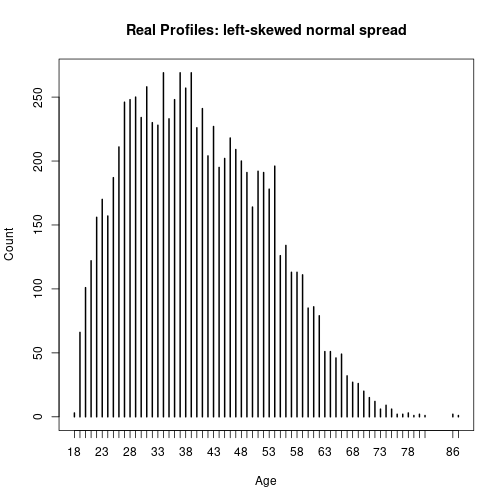
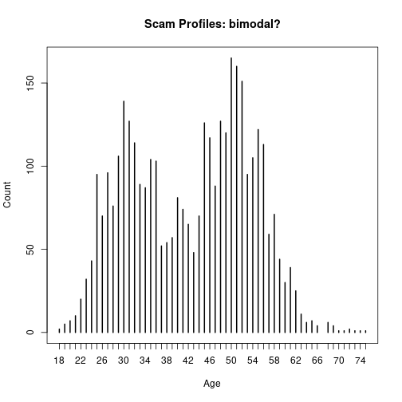
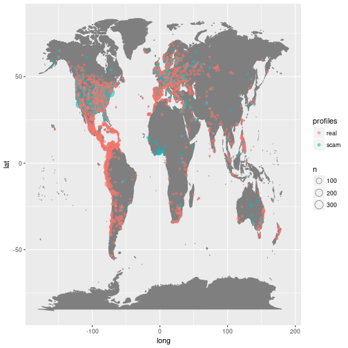
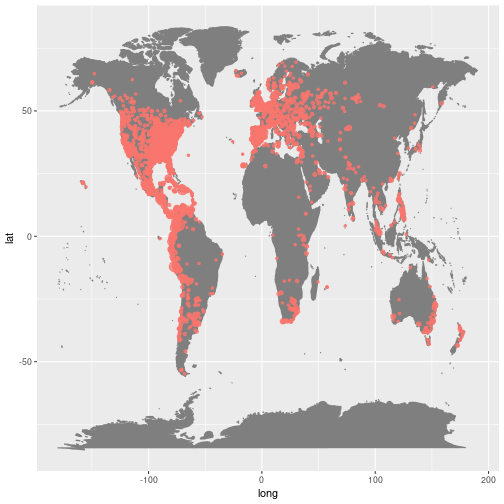
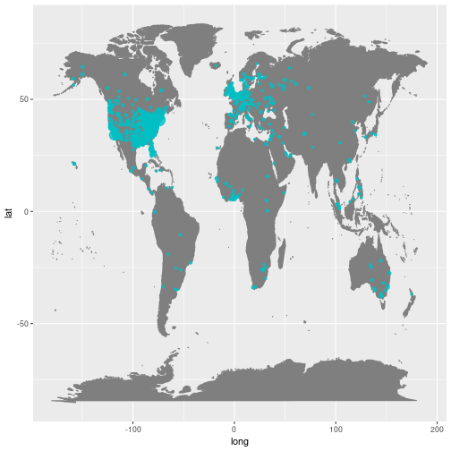
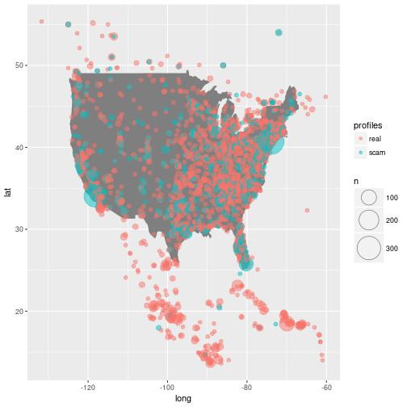
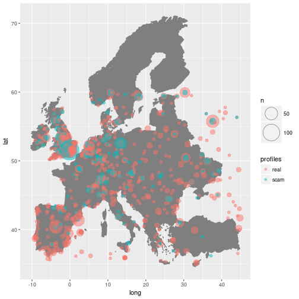

# Demographic Analysis

First things first, we need to load the data. I'm going to focus on only those
variables which are useful for classification (i.e. appear in both scam and 
non-scam profile data) so we can discard the others.


```r
 train <- read.csv("train.csv",na.strings='')
 train <- train[,c(1:7,22,23)]
```

This leaves us with the scam outcome variable and six predictor variables to
work with: username, age, gender, location, ethnicity, occupation. I've also geocoded the location data to produce the 
latitude, longitude variables. One of those variables is 'username', which
doesn't look at all predictive, so we can omit it. I'll compare each of the
remainder in turn and in various combinations
to see what we might expect to be predictive, before building a classifier and
testing it on the test data. First, divide the data on the scam/real line.


```r
 train$username <- NULL
 scam <- train[train$scam == 1,]
 real <- train[train$scam == 0,]
 dim(scam)
```

```
## [1] 3630    8
```

```r
 dim(real)
```

```
## [1] 9856    8
```

You'll note an imbalance between the data, which is fine at this stage.

## Gender

First, the gender variable. I'll quickly define a useful tabulation function.


```r
 kprop <- function(vec){
	kable(as.data.frame(prop.table(sort(table(vec)))))
 }
```

Then we can compare the proportions for scam and real profiles.


```r
 kprop(scam$gender)
```


|vec    |      Freq|
|:------|---------:|
|female | 0.3884298|
|male   | 0.6115702|

```r
 kprop(real$gender)
```


|vec    |      Freq|
|:------|---------:|
|female | 0.4098243|
|male   | 0.5901757|

This doesn't look distinctive, both sets are about 60% male. Gender might be
important in combination with other variables, though. 


## Age

Initially, the age variable looks similarly unpromising. The mean of the scam
profiles is 42.44 compared to 40.34 
for the real profiles. However, when you examine
the distribution of these ages, you get a different story.


```r
 plot(table(real$age), xlab="Age", ylab="Count", main="Real Profiles: left-skewed normal spread")
```



```r
 plot(table(scam$age), xlab="Age", ylab="Count", main="Scam Profiles: bimodal?")
```



The two humps in the data are suggestive. If we investigate the age difference
by gender, we see something more striking in the means:
 
 gender     | scam | real |
------- |------ | ------
female | 31.52 |  41.17
male   | 49.37 |  39.77

In the real data, the average age is around 40 for both males and females. In
the scam data, by contrast, the males are about 50 and the females are about 30.
This 10-year gap is a nice bias, although not a strong signal by itself, as the
real data still covers the same age range. Clearly the scammers perceive older
males and younger females to be more desirable targets to the 40-year-olds on
the dating site. 


## Ethnicity

Moving on to the ethnicity information.


```r
 ethnise <- function(level){
	if(! level %in% c("asian", "black", "hispanic", "middle eastern", "mixed", "native american", "pacific islander", "white")){
		return("other")
	}
	return(level)
 }

 kprop(sapply(as.character(real$ethnicity), ethnise))
```


|vec              |      Freq|
|:----------------|---------:|
|pacific islander | 0.0024351|
|native american  | 0.0089286|
|middle eastern   | 0.0098417|
|asian            | 0.0433239|
|mixed            | 0.0494115|
|black            | 0.0563109|
|other            | 0.0700081|
|hispanic         | 0.3158482|
|white            | 0.4438920|

```r
 kprop(sapply(as.character(scam$ethnicity), ethnise))
```


|vec              |      Freq|
|:----------------|---------:|
|pacific islander | 0.0016529|
|middle eastern   | 0.0112948|
|hispanic         | 0.0157025|
|asian            | 0.0214876|
|other            | 0.0388430|
|mixed            | 0.0672176|
|black            | 0.0694215|
|native american  | 0.1063361|
|white            | 0.6680441|
 
We can see a couple of important differences. Firstly, tbe scam data has a
vanishingly low reporting of hispanic ethnicity, which is the second-largest
group in the real dataset, likely predominantly US-based. This is pretty
strange, and probably says something about who it is the scammers are targeting.
The scam profiles instead are much more heavily weighted towards white and
Native American ethnicities, the latter moving from close to no representation
in the real dataset all the way up to second place in the rank of scammer
ethnicities. This is a very strong signal -- most of the NA profiles we observe
are scammers. Why this is the case is a little puzzling, but might be down to a
perceived desirability of NA partners amongst a romantic US target population.

You might also notice the presence of 'single' in the observed levels. A few
scam profiles seem to have been filled in rather hastily.


## Occupation

There's a long tail in occupation, some 2971 different
values. Many of these are minor variants of each other, so I need to group as many of
them as possible into a defined set of categories. Excuse the long code block.


```r
 employ <- function(level){
	if( grepl("army|milit|marine|soldier|captain|general|solda|force", level) ){
		return("military")
	} else if ( grepl("stud?ent|studi|coll", level) ){
		return("student")
	} else if ( grepl("self|own|independ|entre|freelanc|propia|autonomo", level)) {
		return("self-employed")
	} else if ( grepl("engin|ingenier|mechanic|mecanic|automot", level)) {
		return("engineering")
	} else if ( grepl("gover|civil|public|^un[$ ]", level)) {
		return("government")
	} else if ( grepl("academ|profes|research|lectur|universi|ologist|phd", level)){
		return("academic")
	} else if ( grepl("nurs|enfermer|care|trainer|nanny|baby|niñera|social", level)) {
		return("carer")
	} else if ( grepl("construc|carpent|roof|build|survey|ass?es|crane|equipment", level)){
		return("construction")
	} else if ( grepl("secur|detect|polic|investig|guard|custod|correct", level)){
		return("security")
	} else if ( grepl("econom|analy", level)){
		return("analyst")
	} else if ( grepl("farm|agri", level)){
		return("agriculture")
	} else if ( grepl("sail|sea|fish", level)){
		return("naval")
	} else if ( grepl("weld|factory|manufact|machin|industr", level)){
		return("manufacturing")
	} else if ( grepl("tech|inform|^it[$ ]|telecom|téch|software|sistem|system|tecnico|técnico|program|network|comput|electro|teck|develop", level) ){
		return("technology")
	} else if ( grepl("retail|comerci|shop|clerk|store|wait|vend|sell|cashier|assist|tender|customer|asist|mesero|restaur|camarer", level)){
		return("service")
	} else if ( grepl("tour|holiday|vacat|steward|flight|travel|turis|hotel", level)){
		return("tourism")
	} else if ( grepl("sale|market|ventas", level)) {
		return("sales")
	} else if ( grepl("writ|journal|period", level)){
		return("writing")
	} else if ( grepl("handy|repair|repare|maint|plumb|electr|manteni|hvac", level)){
		return("repair")
	} else if ( grepl("estat", level)){
		return("real estate")
	} else if ( grepl("teach|educa|docen|maestr|lehr", level)) {
		return("teacher")
	} else if ( grepl("manag|supervis", level)){
		return("manager")
	} else if ( grepl("contra", level)){
		return("contractor")
	} else if ( grepl("ama de casa|wife|mother|mom|home|hogar", level)){
		return("housewife")
	} else if ( grepl("unemploy|desempl|not work", level)){
		return("unemployed")
	} else if ( grepl("financ|bank|insur|trad|negoci|cajero", level)){
		return("finance")
	} else if ( grepl("chef|cook|bake|co[cs]iner|hospitali|food", level)){
		return("hospitality")
	} else if ( grepl("secret|admin|recep|office|human resources|clerical|profec|entry", level)){
		return("clerical")
	} else if ( grepl("driver|transport|deliver|ship|chofer|pilot|logist|cargo", level)){
		return("transport")	
	} else if ( grepl("housekeep|clean|limpi|janitor", level)){
		return("cleaner")
	} else if ( grepl("architec|arquitec", level)){
		return("architect")
	} else if ( grepl("account|contad", level)){
		return("accounting")
	} else if ( grepl("law|judge|solicitor|barrister|legal|attorney|abogad", level)){
		return("legal")
	} else if ( grepl("music|sport|play|produc|músico|deporti|conduc|soccer", level)){
		return("entertainment")
	} else if ( grepl("artist|art|paint|sculpt|boutique|photo|foto|choreo", level)){
		return("artist")
	} else if ( grepl("jewel|antiq|print", level)){
		return("specialist")
	} else if ( grepl("doctor|physic|ician|medic|psicolog|terap|therap|salud|health|médic|surgeon|denti|pharma", level)){
		return("medical")
	} else if ( grepl("beaut|styl|estili|peluquer|hair|salon|manic", level)){
		return("beauty")
	} else if ( grepl("fashion|model", level)){
		return("fashion")
	} else if ( grepl("design|decor|flower|desiñ|deisñ", level)){
		return("designer")
	} else if ( grepl("warehouse|work|opera|obrer|labor|labour|landscap|mining|mine|load|trabajo|pack|foreman", level)){
		return("manual")
	} else if ( grepl("bus[iy]?nes|empresa|execut|direct|ceo|ejecut", level)) {
		return("business")
	} else if ( grepl("consult", level)) {
		return("consultant")
	} else if ( grepl("retir|jubilad|pension", level)) {
		return("retired")
	} else if ( grepl("disab", level)) {
		return("disabled")
	} else if (is.na(level)) {
		return(NA)
	} else {
		return("other")
	}
 }

 scam$occ_group <- as.factor(sapply(scam$occupation, employ))
 real$occ_group <- as.factor(sapply(real$occupation, employ))

 khead <- function(vec){
	kable(as.data.frame(tail(prop.table(sort(table(vec))),10)))
 }
```

Occupations typically split on gender, so we should include that in our analysis. 


```r
khead(real$occ_group[real$gender == 'male'])
```


|vec           |      Freq|
|:-------------|---------:|
|manual        | 0.0320600|
|service       | 0.0361528|
|transport     | 0.0378581|
|construction  | 0.0463847|
|retired       | 0.0518417|
|student       | 0.0521828|
|technology    | 0.0576398|
|engineering   | 0.0706003|
|self-employed | 0.0774216|
|other         | 0.1452933|

```r
khead(scam$occ_group[scam$gender == 'male'])
```


|vec           |      Freq|
|:-------------|---------:|
|sales         | 0.0161780|
|architect     | 0.0192113|
|medical       | 0.0328615|
|contractor    | 0.0364004|
|other         | 0.0384226|
|business      | 0.0561173|
|construction  | 0.0581395|
|self-employed | 0.0975733|
|engineering   | 0.2426694|
|military      | 0.2451972|

Ignoring the long tail category of 'other', which captures a lot of odd or misspelt occupations,
the largest employment group for actual males was 'self-employed', followed by careers in engineering
and technology, and then by student and retired status. 'Retired' is the most common label from
the row occupation data.  By contrast, the scam profiles boast a whopping 25% of male
profiles as 'military' and 24% as engineers. This is a much tighter occupational clustering than
we see in the real population, no doubt again reflecting a perceived desirability of these
occupations. Students don't make the top 10 male scammer professions, and only 2 male scam profiles 
report themselves as retired.


```r
khead(real$occ_group[real$gender == 'female'])
```


|vec           |      Freq|
|:-------------|---------:|
|medical       | 0.0332159|
|housewife     | 0.0337192|
|self-employed | 0.0372421|
|retired       | 0.0473075|
|clerical      | 0.0568697|
|teacher       | 0.0598893|
|service       | 0.0659285|
|carer         | 0.0820332|
|student       | 0.1051837|
|other         | 0.1474585|

```r
khead(scam$occ_group[scam$gender == 'female'])
```


|vec           |      Freq|
|:-------------|---------:|
|fashion       | 0.0340087|
|business      | 0.0361795|
|other         | 0.0361795|
|finance       | 0.0376266|
|service       | 0.0412446|
|military      | 0.0549928|
|sales         | 0.0723589|
|carer         | 0.0904486|
|self-employed | 0.1599132|
|student       | 0.2069465|

For females, the scam profiles do manage to get the top professions right -- 'student' and 'carer' 
categories (the latter of which includes 'nurse'), but the scam data is once again highly 
concentrated compared to the real profiles, with 1 in 5 female scam
profiles purporting to be from students. The remaining female scam profiles are also
unusually concentrated, with some 16% being self-employed, and the odd appearance of
a 'military' profession in the top 10, some 5% of female scam profiles. The
prevalence of Spanish-language occupations is also notable here in the raw occupation
data for real profiles.

## Location

The location data associated with the profiles is surprisingly complete. I harvested the 
lat/lon coordinates for the named locations offline, which lets us plot the points. 


```r
library(ggplot2)
library(ggmap)

profiles = ifelse(train$scam, "scam", "real")
world_map <- borders("world", colour="gray50", fill="gray50")


combined_points <- ggplot() + world_map + geom_count(data=train,  aes(x= longitude, y=latitude, fill = profiles, color=profiles), alpha=0.5, shape = 21)
plot(combined_points)
```

```
## Warning: Removed 976 rows containing non-finite values (stat_sum).
```



This combined plot is a little hard to read, but it can be helped by looking at the separate plots below:


```r
real_map <- ggplot() + world_map + geom_count(data=real,  aes(x = longitude, y = latitude), color="#F8766D", fill="#F8766D",  alpha=0.8, shape = 21, show.legend=F)
plot(real_map)
```

```
## Warning: Removed 818 rows containing non-finite values (stat_sum).
```



```r
scam_map <- ggplot() + world_map + geom_count(data=scam,  aes(x = longitude, y = latitude), color="#00BFC4", fill="#00BFC4", alpha=0.8, shape = 21, show.legend=F)
plot(scam_map)
```

```
## Warning: Removed 158 rows containing non-finite values (stat_sum).
```



We can see the scam profiles mostly purport to be from the US or Western Europe, with a 
small but significant cluster in West Africa. Also notable is the absence of
scammer profiles purporting to be from Latin America, a sizeable population in
the real data -- this lines up with the prior observations from the ethnicity
data. 

It's worth zooming in to a couple of locations for a closer look. Below is the US:


```r
us_map <- borders("usa", color="gray50", fill="gray50")
```

```
## Warning: The plyr::rename operation has created duplicates for the
## following name(s): (`colour`)
```

```r
us_xlim <- c(-139.3, -58.8) 
us_ylim = c(13.5, 55.7)
us_data <- train[which(train$longitude > us_xlim[1] & train$longitude < us_xlim[2] & train$latitude > us_ylim[1] & train$latitude < us_ylim[2]),]
profiles = ifelse(us_data$scam, "scam", "real")

combined_points <- ggplot() + us_map + geom_count(data=us_data,  aes(x=longitude, y=latitude, fill = profiles, color=profiles), alpha=0.5, shape = 21) + scale_size(range=c(2,15))

plot(combined_points)
```



We can see that the scam profiles are highly concentrated in certain well-known locations, 
to a degree much greater than the real profiles. New York is a common one, as are LA and Miami. However,
the scammers do still spread themselves across the country, even appearing to populate the Midwestern 
states more than the real profiles.


```r
europe <- c("Austria","Belgium","Bulgaria","Croatia","Cyprus",
                   "Czech Rep.","Denmark","Estonia","Finland","France",
                   "Germany","Greece","Hungary","Ireland","Italy","Latvia",
                   "Lithuania","Luxembourg","Malta","Netherlands","Poland",
                   "Portugal","Romania","Slovakia","Slovenia","Spain",
                   "Sweden","United Kingdom","Turkey","Ukraine","Belarus","Slovakia","Norway",
		   "Albania","Scotland","Northern Ireland","Switzerland","Yugoslavia","Croatia","Bosnia",
		   "Estonia","Serbia", "Macedonia", "Moldova","Montenegro","Kosovo","UK")

eu_xlim <-  c(-20, 45)
eu_ylim <- c(35, 60.0)
eu_map <- borders("world", europe, color="gray50", fill="gray50", xlim=eu_xlim, ylim=eu_ylim)
```

```
## Warning: The plyr::rename operation has created duplicates for the
## following name(s): (`colour`)
```

```r
eu_data <- train[which(train$longitude > eu_xlim[1] & train$longitude < eu_xlim[2] & train$latitude > eu_ylim[1] & train$latitude < eu_ylim[2]),]

profiles = ifelse(eu_data$scam, "scam", "real")

combined_points <- ggplot() + eu_map + geom_count(data=eu_data,  aes(x=longitude, y=latitude, fill = profiles, color=profiles), alpha=0.5, shape = 21) + scale_size(range=c(2,15))

plot(combined_points)
```



Within Europe, we see the greatest concentration of supposed locations in the
west, with UK cities like London being the largest presence, and several
concentrations in Germany, most particularly Berlin. Scam profiles comparatively
rarely present themselves as from Eastern Europe or Spain. 

Finally, we can tabulate the most common locations. Firstly, just at the city level:


```r
khead(scam$location)
```


|vec                                    |      Freq|
|:--------------------------------------|---------:|
|California, United States              | 0.0080088|
|Austin, Texas, United States           | 0.0096658|
|New York                               | 0.0096658|
|Berlin, Germany                        | 0.0121513|
|Houston, Texas, United States          | 0.0124275|
|Dallas, Texas, United States           | 0.0165700|
|Miami, Florida, United States          | 0.0171223|
|London, United Kingdom                 | 0.0345209|
|Los Angeles, California, United States | 0.0530240|
|New York, United States                | 0.0892019|

```r
khead(real$location)
```


|vec                                   |      Freq|
|:-------------------------------------|---------:|
|Cali, Cali, Valle del Cauca, Colombia | 0.0054126|
|Distrito de Lima, Perú                | 0.0058211|
|Lima, Perú                            | 0.0058211|
|Bogotá, Colombia                      | 0.0059232|
|Bogotá, Bogotá, Colombia              | 0.0063317|
|Panama City, Panama                   | 0.0065359|
|London, UK                            | 0.0066381|
|Quito, Ecuador                        | 0.0069444|
|Lima, Peru                            | 0.0070466|
|Bogotá, Bogota, Colombia              | 0.0103145|

As expected, the scammers are more tightly clustered (9% in just New York, compared to the 
real users' largest clustering of 1%). Once again, we see the effects of the anti-hispanic bias
in the scammer profiles. This data is a bit fiddly, so it might be better to look at the results
by the broadest component of the location.


```r
getnation <- function(location){
	locstrs <- strsplit(as.character(location), ',')[[1]]
	return(tolower(trimws(locstrs[length(locstrs)])))
}

scam_nation <- sapply(scam$location, getnation)
real_nation <- sapply(real$location, getnation)

khead(scam_nation)
```


|vec            |      Freq|
|:--------------|---------:|
|ghana          | 0.0093897|
|australia      | 0.0104943|
|canada         | 0.0118752|
|new york       | 0.0138083|
|florida        | 0.0140845|
|texas          | 0.0154653|
|california     | 0.0185032|
|germany        | 0.0234742|
|united kingdom | 0.0715272|
|united states  | 0.5769125|

```r
khead(real_nation)
```


|vec       |      Freq|
|:---------|---------:|
|canada    | 0.0193015|
|russia    | 0.0217525|
|perú      | 0.0224673|
|venezuela | 0.0261438|
|mexico    | 0.0291054|
|méxico    | 0.0306373|
|ee. uu.   | 0.0403391|
|uk        | 0.0424837|
|colombia  | 0.0665850|
|usa       | 0.3209763|

Once again, we see a massive concentration in scam profiles. Well over half of them are purporting to be
in the US, compared with more like a third of the real data. The UK and Germany are the secondary targets.
The more honest answer of Ghana also makes the top list. Country names appear to be recorded slightly differently
for some reason (USA vs United States), so it may be best to avoid using these factors for machine learning (as this
is more likely down to how the data is annotated than presented by scammers). 

